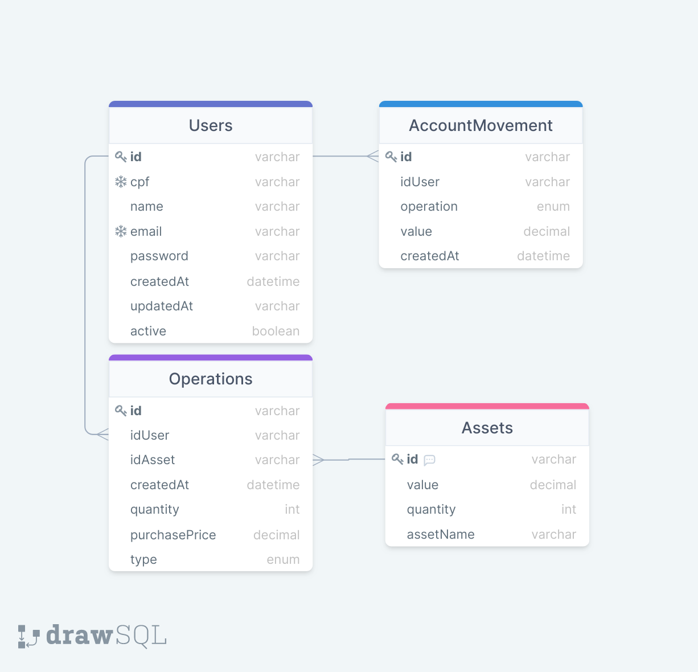

# Brokerage API

Esse projeto é uma api de corretagem onde se pode comprar e vender ativos.
A corretora contém uma lista de ativos com o preço e a quantidade disponível.
Os usuários tem um cadastro e uma conta onde se pode depositar e sacar seus fundos.
Todas as movimentações são salvas no banco de dados, sendo elas de ativos (compra e venda) ou na conta de usuários (compra e venda de ativos, depósitos e saques).


## Tecnologias utilizadas

- Node
- Express
- Express Async Erros
- TypeScript
- Bcrypt
- Dotenv
- Http Status Codes
- JOI
- JWT
- Eslint
- Prettier
- Conventional Commits
- Nodemon
- Prisma
- PostgreSQL
- Ts Node
- Swagger

## Executando o projeto
### Pré-requisitos
- Docker
- Docker Compose
- Yarn
### Instalando dependências
```
yarn i
```
### Subindo ambiente Docker
```
docker-compose up -d
```
### Executando aplicação
```
docker exec -it brokerage sh

# para criar o banco:
yarn db:push  

# para popular o banco:
yarn db:seed

# para subir a aplicação
yarn start

```

## Variáveis de Ambiente

Esse projeto utiliza variáveis de ambiente. 
Essas variáveis já estão no arquivo `docker-compose.yml`

`NODE_PORT`: a porta onde o servidor irá rodar no container

`DB_URL`: dados para conexão com o BD

`JWT_SECRET`: frase de segredo para JWT

`SALT_ROUNDS`: número para ser utilizado na criptografia das senhas

**Para modificar a porta** é necessário modificar a variável `NODE_PORT` 
e as portas na linha 17 do arquivo `docker-compose.yml` para a porta desejada.
## Aprendizados

### Soft Skills

- Resiliência: pois me deparei com muitas dificuldades com TypeScript mas mesmo assim continuei e terminei;
- Aprendizado rápido: tive de aprender novas tecnologias em um curto tempo lendo documentações, vendo vídeos e pesquisando muito;
- Gestão do tempo: por estar desenvolvendo ao mesmo tempo que tinham muitas atividades da Trybe;
- Errar rápido: muitas ideias que eu tive no início não funcionavam bem e corrigi de forma eficaz a tempo;
- Sonhar grande: assumi fazer o desafio em TypeScript com POO e Prisma, tecnologias que não tinha profundidade mas queria fazer algo diferente do que eu estava acostumado a fazer.


### Hard Skills

- TypeScript: foi um grande desafio conseguir fazer todo o projeto utilizando TS. Aprendi muito pesquisando e com tentativa e erro;
- Prisma: nunca tinha usado antes desse projeto. É um ORM muito simples, de fácil aprendizado com uma documentação muito bem feita;
- POO: foi a primeira vez que apliquei POO em uma API Node;
- Bcrypt: foi utilizada para fazer o hash das senhas dos usuários.
## Banco de dados
O banco de dados utilizado foi o PostgreSQL pois para deploy o Heroku tem esse BD gratuito para uso.
A estrutura do BD foi feita dessa forma:




Foi criado a tabela `Operations` para guardar todas as operações feitas na corretora.
Foi criado a tabela `AccountMovement` para salvar todas as movimentações financeiras dos usuários, sejam elas de saque e depósito como de compra e vendas de ativos.

A princípio a modelagem contaria com uma tabela chamada `Wallet` que serviria para guardar o resumo de investimentos do usuário. Isso serviria para não ter a necessidade de em todas as requisições fazer a verificação da tabela `Operations` para ter o saldo de de ações do usuário e verificar quais ações ele contém 1 ou maís ativos.

Foi tomado a decisão de remover essa tabela `Wallet` pois ela teria uma espécie de redundância de dados. Então foi decidido arcar com o processamento para percorrer a tabela `Operations` para ter os dados necessários ao invés de ter todos esses dados na tabela `Wallet`.


## Tomadas de decisões
### Banco de dados
Foi escolhido o PostgreSQL por ser um serviço gratuito no Heroku ao fazer deploy.

Não queria usar o Sequelize por ser muito complicado de implementar, então fui atrás de uma tecnologia que tinha ouvido falar a algum tempo atrás e que era muito mais simples. O Prisma é um ORM que abstrai demais a implementação e facilita muito a vida do DEV.

A dificuldade foi de aprender essa nova tecnologia.

Para isso fui atrás da documentação oficial do Prisma e alguns videos no YouTube. Dessa forma com tentativa e erro consegui aprender e fazer funcionar no projeto.

### TypeScript com POO
Eu nunca tinha feito uma API utilizando o conceito de POO antes, mas sabendo que o backend da XP Inc. é em C# e todo em POO me fiz esse desafio. 

Pesquisei bastante como se implementar as camadas MSC utilizando POO e fui na tentativa e erro.

Algumas coisas eu não soube como implementar com classes que é o caso do middleware, mas assim que eu terminar o projeto, posso voltar e tentar refatorar para POO.

Uma dificuldade grande que eu tive foi na segregação de interfaces, que eu ainda não sei fazer direito.

Nas classes de controller não consegui instanciar a classe service da forma padrão pelo constructor. Procurei na internet uma forma de resolver e não achei qualquer lugar que comentasse sobre isso. Então para resolver o problema fiz os métodos estáticos e funcionou.

### Criptografar senhas
É de suma importância se importar com segurança em sua aplicação e seus clientes.

Por esse motivo salvei as senhas dos usuários cadastrados nessa aplicação como hashes para não manipular diretamente o segredo dos clientes. 

### JWT
Foi utilizado JWT nesse projeto para promover segurança de autenticação.

Para todas as rotas que necessitam da identificação do usuário, foi utilizado o JWT para essa finalidade, não expondo a identificação do usuário em nenhum endereço de rota.

### API REST
Para Usuários e Ativos foram implementado rotas REST (GET, POST, PUT, DELETE) por ser uma boa prática.

### Swagger
Foi utilizado o Swagger para documentar as funcionalidades e rotas do projeto.

### Testes
Foi utilizado o Jest para testar o projeto. Por falta de tempo não consegui fazer todos os testes, mas foquei em deixar uma parte muito bem testada para demonstrar zelo pelo código.